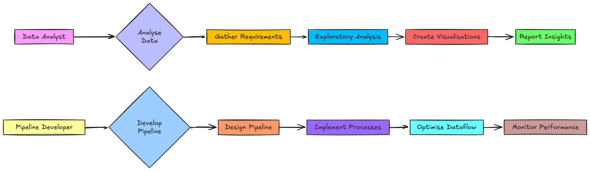
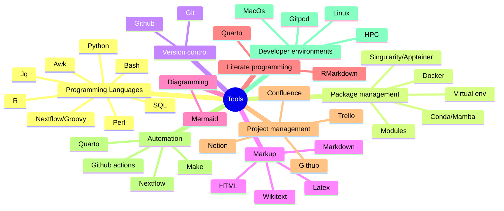

# Hi there 👋

### I'm Mahesh Binzer-Panchal

[My profile summary](https://profile-summary-for-github.com/user/mahesh-panchal)

<table style="width:100%; border:0">
  <tr>
    <td>

- Bioinformatician
- Instructor
- Nextflow Ambassador
- nf-core Maintainer
    </td>
    <td>
      
    </td>
  </tr>
</table>

## Bioinformatician: 
### At the National Bioinformatics Infrastructure Sweden, SciLifeLab.

I support research groups by performing bioinformatic analyses and developing workflows on [request](https://nbis.se/support/support.html). 
My bioinformatic expertise focuses on de novo genome assembly, but I am also able to perform other sequence based analyses, such as variant 
calling, amplicon analysis, ancient DNA analysis, and more. In addition to my support work, I'm currently helping develop a 
[genome assembly and annotation workflow](https://github.com/NBISweden/Earth-Biogenome-Project-pilot) for the Swedish Pilot Project 
in the Earth Biogenome Project. As part of my support work, I aim to make my work reproducible, using version control, workflow managers, 
and containerized software. I use [this template](https://github.com/mahesh-panchal/NBIS_project_template) as the starting point for my work,
keeping data, files, and code organised, and hopefully easy to follow and extend for those I support.

I'm adept at programming, and writing workflows in particular. I'm well versed in Bash scripting, as well being able to use Perl, awk, sed, 
and R too. I write workflows using the Nextflow workflow language, based on Groovy. I have used various other languages in the past 
including Java, C, C++, Turing, Haskell, Prolog, and Assembly, including database languages such as PostgresQL. I'm familiar with various 
markup and serialization languages such as Markdown, HTML, Wiki Markup, Latex, and YAML. In my work, I regularity use Git, Docker, and Singularity, 
as well as Github Actions and Makefiles for automation, and Gitpod as a development environment.

## Nf-core Maintainer and Nextflow Ambassador

I contribute to the nf-core and Nextflow community, helping answer questions and develop best-practice workflows.
- [A thank you from Phil Ewels on behalf of the nf-core community at the Nextflow summit](https://youtu.be/B-OqciShiHY?si=xGisdrmFm89g--8-&t=718)

I'm currently a [Nextflow Ambassador](https://www.nextflow.io/ambassadors.html), and an [nf-core Maintainer](https://nf-co.re/governance#maintainers). 

  
Expand for my notable contributions

  - [Driving nf-core to use native syntax for workflow data publishing and tool parameter passing](https://github.com/nf-core/rnaseq/pull/701)
    - Hear Dr H Patel explain the work at the nf-core Hackathon on [Youtube](https://www.youtube.com/watch?v=Lo2jXn8tHU0).
  - [Adding a Gitpod dev environment for testing workflows, tools, and modules](https://github.com/nf-core/tools/pull/1384)
  - Enabling the process `when:` declaration to be used from a configuration file.
    - [Template update](https://github.com/nf-core/tools/pull/1393).
    - [Update existing modules](https://github.com/nf-core/modules/pull/1261).
    - [Documentation update](https://github.com/nf-core/nf-co.re/pull/1012).
    - [Module Linter update](https://github.com/nf-core/tools/pull/1397).
    - Hear Dr M Garcia explain how he used this to tidy up the nf-core Sarek codebase on [YouTube](https://www.youtube.com/watch?v=17NqUsh73BU)
  - Code reviews for large pipelines such as nf-core/Sarek, nf-core/HiCar and nf-core/Metatdenovo.
  - The addition of several tools for genome assembly to nf-core/modules
  - Demonstrating how to chain existing workflows in a meta-pipeline: https://github.com/mahesh-panchal/nf-cascade.

### Interesting Nextflow repos

## Instructor

I am a certified Carpentries Instructor. I have helped develop [The Carpentries Introduction to Nextflow](https://github.com/carpentries-incubator/workflows-nextflow).

I'm a teaching assistant on the NBIS/Elixir Tools for Reproducible Research course, and engage in reguar team development:

### Languages and Tools:

As a bioinformatician, I use a variety of tools to aid my work. These are tools I have used in recent years.

