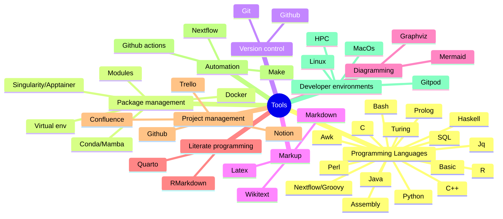

  

  
  

# Hi 👋, I'm Mahesh Binzer-Panchal
### A bioinformatician working for the National Bioinformatics Infrastructure Sweden.

I support research groups by performing bioinformatic analyses and developing workflows on [request](https://nbis.se/support/support.html). 
My bioinformatic expertise focuses on de novo genome assembly, but I am also able to perform other sequence based analyses, such as variant 
calling, amplicon analysis, ancient DNA analysis, and more. In addition to my support work, I'm currently helping develop a genome assembly 
and annotation workflow for the Swedish Pilot Project in the Earth Biogenome Project. As part of my support work, I aim to make my work 
reproducible, using version control, workflow managers, and containerized software. The following template is the starting point for my work, 
keeping it organised, and hopefully easy to follow and extend for those I support.

- [Earth Biogenome Project pilot workflow](https://github.com/NBISweden/Earth-Biogenome-Project-pilot)
- [Personal project support template](https://github.com/mahesh-panchal/NBIS_project_template)

I'm adept at programming, and writing workflows in particular. I'm well versed in Bash scripting, as well being able to use Perl, awk, sed, 
and R too. I write workflows using the Nextflow workflow language, based on Groovy. I have also used various other languages in the past 
including Java, C, C++, Turing, Haskell, Prolog, and Assembly, as well database languages such as PostgresQL. I'm also familiar with various 
markup and serialization languages such as Markdown, HTML, Wiki Markup, Latex, and YAML. In my work, I regularity use Git, Docker, and Singularity, 
as well as Github Actions for automation, and Gitpod as a development environment.

In addition, I contribute to the nf-core community, helping answer questions and develop best-practice workflows. Some notable contributions
include:

- [Driving nf-core to use native syntax for workflow data publishing and tool parameter passing](https://github.com/nf-core/rnaseq/pull/701)
  - Hear Dr H Patel explain the work at the nf-core Hackathon on [Youtube](https://www.youtube.com/watch?v=Lo2jXn8tHU0).
- [Adding a Gitpod dev environment for testing workflows, tools, and modules](https://github.com/nf-core/tools/pull/1384)
- Enabling the process `when:` declaration to be used from a configuration file.
  - [Template update](https://github.com/nf-core/tools/pull/1393).
  - [Update existing modules](https://github.com/nf-core/modules/pull/1261).
  - [Documentation update](https://github.com/nf-core/nf-co.re/pull/1012).
  - [Module Linter update](https://github.com/nf-core/tools/pull/1397).
  - Hear Dr M Garcia explain how he used this to tidy up the nf-core Sarek codebase on [YouTube](https://www.youtube.com/watch?v=17NqUsh73BU) 

As a certified Carpentries Instructor, I help develop and teach The Carpentries Introduction to Nextflow.

- [Introduction to Nextflow and nf-core](https://github.com/carpentries-incubator/workflows-nextflow)
  
  Learn Nextflow using Gitpod - A collaborative developer environment (Nextflow, nf-core, git, docker, conda, and mamba are preinstalled).
  
   

### Languages and Tools:

| Tools |   |
|----|---|
| <a href="https://www.linux.org/" target="_blank" rel="noreferrer"> Linux</a> | |
| <a href="https://www.gnu.org/software/bash/" target="_blank" rel="noreferrer"> Bash</a> | <a href="https://www.perl.org/" target="_blank" rel="noreferrer"> Perl</a> |
| <a href="https://git-scm.com/" target="_blank" rel="noreferrer"> Git</a> | |
| <a href="https://www.docker.com/" target="_blank" rel="noreferrer"> Docker</a> | |

&nbsp;

